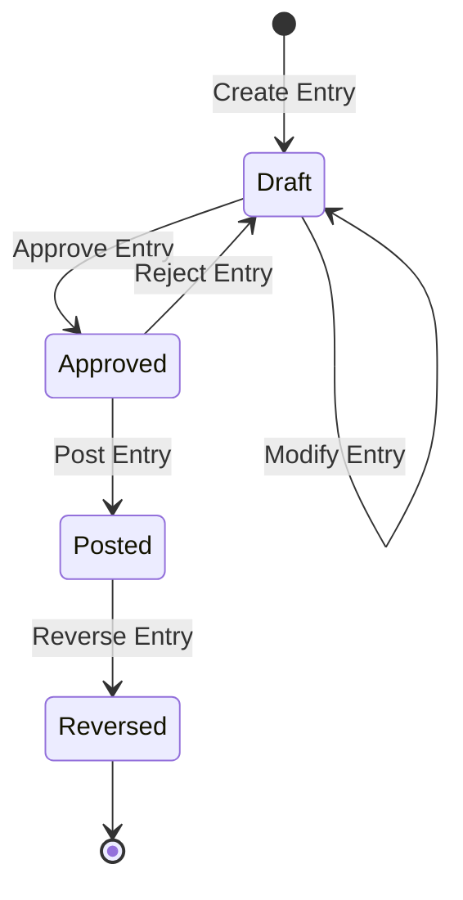

# AIBOS ERP Business Logic Guide

*The definitive guide to understanding and implementing business logic in the AI-BOS ERP accounting system*

## Introduction

This guide provides a comprehensive overview of the business logic embedded within the AIBOS ERP system. Written from the perspective of SaaS engineers, CFOs, accountants, auditors, and bookkeepers, it serves as both a technical reference and a business blueprint for understanding how our accounting engine processes complex financial transactions.

## Core Business Concepts

### Double-Entry Bookkeeping

The foundation of our accounting system is the double-entry bookkeeping principle: **every transaction affects at least two accounts, and the total debits must equal the total credits**.

```typescript
// Example: Cash sale of $1,000
const journalEntry = {
  entries: [
    { accountCode: 'CASH', debitAmount: 1000, creditAmount: 0 },      // Asset increase (debit)
    { accountCode: 'SALES', debitAmount: 0, creditAmount: 1000 },     // Revenue increase (credit)
  ]
};
```

**Business Rule Validation:**
- Minimum 2 lines per journal entry
- Maximum 100 lines per journal entry
- Debits must equal credits (within 0.01 tolerance)
- All accounts must exist and be active
- Posting must be allowed on all accounts

### Chart of Accounts Structure

Our chart of accounts follows a hierarchical structure with five main account types:

```typescript
export enum AccountType {
  ASSET = 'Asset',           // Resources owned by the company
  LIABILITY = 'Liability',   // Debts and obligations
  EQUITY = 'Equity',         // Owner's interest in the company
  REVENUE = 'Revenue',       // Income from operations
  EXPENSE = 'Expense',       // Costs of operations
}
```

**Account Hierarchy Rules:**
- Parent accounts cannot have postings (control accounts)
- Child accounts inherit parent account type
- Account codes must be unique within tenant
- Account codes follow alphanumeric format (3-20 characters)
- Special account types have specific business rules

### Special Account Types

Advanced account types for complex business scenarios:

```typescript
export enum SpecialAccountType {
  ACCUMULATED_DEPRECIATION = 'AccumulatedDepreciation',    // Contra-asset
  ALLOWANCE_FOR_DOUBTFUL_ACCOUNTS = 'AllowanceForDoubtfulAccounts', // Contra-asset
  CONTROL_RETAINED_EARNINGS = 'ControlRetainedEarnings',   // Control account
  FX_GAIN = 'FxGain',                                      // Foreign exchange gain
  FX_LOSS = 'FxLoss',                                      // Foreign exchange loss
  INTERCO_RECEIVABLE = 'IntercompanyReceivable',           // Intercompany transactions
  INTERCO_PAYABLE = 'IntercompanyPayable',                // Intercompany transactions
}
```

## Transaction Processing Workflow

### Journal Entry Lifecycle



**Status Transitions:**
- **Draft**: Entry is being prepared, can be modified
- **Approved**: Entry is validated and ready for posting
- **Posted**: Entry is committed to the general ledger
- **Reversed**: Entry has been reversed with explanation

### Multi-Currency Processing

Our system handles multi-currency transactions with automatic FX conversion:

```typescript
// Example: Multi-currency journal entry
const multiCurrencyEntry = {
  entries: [
    { accountCode: 'CASH_USD', debitAmount: 1000, creditAmount: 0, currency: 'USD' },
    { accountCode: 'SALES', debitAmount: 0, creditAmount: 4200, currency: 'MYR' },
  ],
  baseCurrency: 'MYR',
  postingDate: new Date('2024-01-15'),
};
```

**FX Processing Rules:**
1. **Original Currency Validation**: Entry must balance in original currencies
2. **FX Rate Application**: Convert to functional currency using historical rates
3. **Rebalancing**: Handle rounding differences automatically
4. **Rate Tracking**: Store FX rates used for audit trail
5. **Functional Currency**: All reporting in base currency (MYR)

### Account Balance Management

Account balances are automatically maintained with strict validation:

```typescript
export class Account {
  public updateBalance(amount: number): Account {
    const next = round2(this.balance + amount);
    const now = new Date();
    const nextAccount = new Account({
      ...this.toProps(),
      balance: next,
      updatedAt: now,
    });
    nextAccount.validateBalance(); // Enforces polarity rules
    return nextAccount;
  }

  public validateBalance(): void {
    if (this.isDebitAccount() && this.balance < 0) {
      throw new Error(`Debit account ${this.accountCode} cannot have negative balance`);
    }
    if (this.isCreditAccount() && this.balance > 0) {
      throw new Error(`Credit account ${this.accountCode} cannot have positive balance`);
    }
  }
}
```

**Balance Rules:**
- **Debit Accounts** (Assets, Expenses): Positive balances only
- **Credit Accounts** (Liabilities, Equity, Revenue): Negative balances only
- **Balance Updates**: Atomic operations with validation
- **Rounding**: All amounts rounded to 2 decimal places
- **Immutability**: Account objects are immutable value objects

## Financial Reporting Logic

### Profit & Loss Statement

The P&L statement shows company profitability over a period:

```typescript
export interface ProfitAndLossStatement {
  readonly revenue: {
    readonly grossRevenue: number;
    readonly netRevenue: number;
    readonly revenueAccounts: Array<{
      readonly accountCode: string;
      readonly accountName: string;
      readonly amount: number;
    }>;
  };
  readonly expenses: {
    readonly totalExpenses: number;
    readonly expenseAccounts: Array<{
      readonly accountCode: string;
      readonly accountName: string;
      readonly amount: number;
    }>;
  };
  readonly netIncome: number;
  readonly grossProfit: number;
  readonly operatingIncome: number;
}
```

**P&L Calculation Logic:**
- **Revenue**: Sum of all Revenue account balances for the period
- **Expenses**: Sum of all Expense account balances for the period
- **Net Income**: Revenue minus Expenses
- **Period-based**: Uses period balances from general ledger projection
- **Multi-currency**: All amounts converted to functional currency

### Balance Sheet

The balance sheet shows company financial position at a point in time:

```typescript
export interface BalanceSheet {
  readonly assets: {
    readonly currentAssets: Array<AccountBalance>;
    readonly fixedAssets: Array<AccountBalance>;
    readonly totalAssets: number;
  };
  readonly liabilities: {
    readonly currentLiabilities: Array<AccountBalance>;
    readonly longTermLiabilities: Array<AccountBalance>;
    readonly totalLiabilities: number;
  };
  readonly equity: {
    readonly equityAccounts: Array<AccountBalance>;
    readonly totalEquity: number;
  };
  readonly totalLiabilitiesAndEquity: number;
  readonly isBalanced: boolean;
}
```

**Balance Sheet Logic:**
- **Assets**: Current assets (cash, AR, inventory) + Fixed assets (equipment, buildings)
- **Liabilities**: Current liabilities (AP, accrued) + Long-term liabilities (loans, mortgages)
- **Equity**: Owner's equity accounts
- **Balance Validation**: Assets = Liabilities + Equity
- **Point-in-time**: Snapshot as of specific date

### Cash Flow Statement

The cash flow statement shows cash movements during a period:

```typescript
export interface CashFlowStatement {
  readonly operatingActivities: {
    readonly netIncome: number;
    readonly adjustments: Array<{
      readonly description: string;
      readonly amount: number;
    }>;
    readonly netCashFromOperations: number;
  };
  readonly investingActivities: {
    readonly activities: Array<{
      readonly description: string;
      readonly amount: number;
    }>;
    readonly netCashFromInvesting: number;
  };
  readonly financingActivities: {
    readonly activities: Array<{
      readonly description: string;
      readonly amount: number;
    }>;
    readonly netCashFromFinancing: number;
  };
  readonly netChangeInCash: number;
  readonly beginningCash: number;
  readonly endingCash: number;
}
```

**Cash Flow Logic:**
- **Operating**: Net income + non-cash adjustments
- **Investing**: Purchase/sale of fixed assets
- **Financing**: Borrowings, repayments, equity transactions
- **Cash Change**: Sum of all three activities
- **Reconciliation**: Beginning cash + Net change = Ending cash

## Advanced Business Rules

### Depreciation Logic

Automatic depreciation with companion account linking:

```typescript
export interface DepreciationRule {
  readonly assetAccountCode: string;
  readonly accumulatedDepreciationCode: string;
  readonly depreciationExpenseCode: string;
  readonly method: 'STRAIGHT_LINE' | 'DECLINING_BALANCE' | 'UNITS_OF_PRODUCTION';
  readonly usefulLife: number; // in months
  readonly salvageValue: number;
  readonly startDate: Date;
}
```

**Depreciation Processing:**
- **Straight-line**: (Cost - Salvage) / Useful Life
- **Monthly Calculation**: Automatic monthly depreciation entries
- **Companion Linking**: Asset linked to Accumulated Depreciation and Depreciation Expense
- **Audit Trail**: Complete history of depreciation calculations

### Intercompany Transactions

Handling transactions between related entities:

```typescript
export interface IntercompanyTransaction {
  readonly fromEntity: string;
  readonly toEntity: string;
  readonly amount: number;
  readonly currency: string;
  readonly description: string;
  readonly transactionDate: Date;
  readonly eliminationRequired: boolean;
}
```

**Intercompany Rules:**
- **Matching Entries**: Automatic creation of offsetting entries
- **Elimination**: Consolidated reporting eliminates intercompany balances
- **Currency**: Support for different currencies between entities
- **Audit Trail**: Complete tracking of intercompany relationships

### Tax Compliance

Built-in tax calculation and compliance features:

```typescript
export interface TaxLine {
  readonly taxType: 'SALES_TAX' | 'INCOME_TAX' | 'WITHHOLDING_TAX';
  readonly taxRate: number;
  readonly taxableAmount: number;
  readonly taxAmount: number;
  readonly taxAccountCode: string;
  readonly jurisdiction: string;
}
```

**Tax Features:**
- **Automatic Calculation**: Tax amounts calculated based on rates and rules
- **Multi-jurisdiction**: Support for different tax jurisdictions
- **Tax Accounts**: Automatic posting to appropriate tax accounts
- **Compliance Reporting**: Tax reports for regulatory requirements

## Data Integrity and Validation

### Business Rule Validation

Comprehensive validation at multiple levels:

```typescript
export class JournalEntryValidator {
  public validateBusinessRules(command: PostJournalEntryCommand): void {
    // Validate minimum and maximum number of entries
    if (command.entries.length < 2) {
      throw new Error('Journal entry must have at least two lines');
    }
    if (command.entries.length > 100) {
      throw new Error('Journal entry cannot have more than 100 lines');
    }

    // Validate amounts are reasonable (business rule)
    const maxAmount = 1_000_000; // $1M limit per entry
    for (const entry of command.entries) {
      if (entry.debitAmount > maxAmount || entry.creditAmount > maxAmount) {
        throw new Error(`Entry amount cannot exceed ${maxAmount.toLocaleString()}`);
      }
    }

    // Validate reference format (business rule)
    if (command.reference && !/^[A-Z0-9-]{3,20}$/.test(command.reference)) {
      throw new Error('Reference must be 3-20 alphanumeric characters with hyphens');
    }
  }
}
```

**Validation Levels:**
- **Domain Level**: Business rules enforced in domain models
- **Service Level**: Cross-cutting concerns and complex validations
- **API Level**: Input validation and sanitization
- **Database Level**: Referential integrity and constraints

### Trial Balance Validation

Real-time trial balance validation:

```typescript
export class TrialBalanceService {
  public async validateTrialBalance(tenantId: string, period: string): Promise<ValidationResult> {
    const balances = await this.getTrialBalance(tenantId, period);
    const totalDebits = balances.reduce((sum, b) => sum + b.debit, 0);
    const totalCredits = balances.reduce((sum, b) => sum + b.credit, 0);
    
    return {
      isBalanced: Math.abs(totalDebits - totalCredits) < 0.01,
      totalDebits,
      totalCredits,
      difference: totalDebits - totalCredits,
      accounts: balances.length,
    };
  }
}
```

**Trial Balance Features:**
- **Real-time Validation**: Continuous balance checking
- **Period-based**: Validation for specific accounting periods
- **Exception Reporting**: Identification of unbalanced accounts
- **Reconciliation**: Variance analysis and correction suggestions

## Error Handling and Recovery

### Business Error Categories

```typescript
export enum BusinessErrorType {
  VALIDATION_ERROR = 'VALIDATION_ERROR',
  BUSINESS_RULE_VIOLATION = 'BUSINESS_RULE_VIOLATION',
  ACCOUNT_NOT_FOUND = 'ACCOUNT_NOT_FOUND',
  INSUFFICIENT_BALANCE = 'INSUFFICIENT_BALANCE',
  CURRENCY_MISMATCH = 'CURRENCY_MISMATCH',
  PERIOD_LOCKED = 'PERIOD_LOCKED',
  DUPLICATE_TRANSACTION = 'DUPLICATE_TRANSACTION',
}
```

**Error Handling Strategy:**
- **Graceful Degradation**: System continues operating despite errors
- **User-friendly Messages**: Clear error messages for business users
- **Audit Trail**: All errors logged with full context
- **Recovery Procedures**: Automated recovery where possible
- **Escalation**: Critical errors escalated to operations team

### Transaction Rollback

Automatic rollback for failed transactions:

```typescript
export class TransactionManager {
  public async executeWithRollback<T>(
    operation: () => Promise<T>,
    rollbackOperation: () => Promise<void>
  ): Promise<T> {
    try {
      return await operation();
    } catch (error) {
      await rollbackOperation();
      throw error;
    }
  }
}
```

**Rollback Features:**
- **Atomic Operations**: All-or-nothing transaction processing
- **Event Rollback**: Automatic reversal of published events
- **State Restoration**: Return to previous consistent state
- **Audit Trail**: Complete record of rollback operations

## Performance Considerations

### Batch Processing

Efficient processing of large transaction volumes:

```typescript
export class BatchProcessor {
  public async processJournalEntries(
    entries: PostJournalEntryCommand[],
    batchSize: number = 100
  ): Promise<ProcessingResult[]> {
    const batches = this.chunkArray(entries, batchSize);
    const results: ProcessingResult[] = [];
    
    for (const batch of batches) {
      const batchResult = await this.processBatch(batch);
      results.push(batchResult);
    }
    
    return results;
  }
}
```

**Batch Processing Benefits:**
- **Memory Efficiency**: Process large datasets without memory issues
- **Performance**: Optimized database operations
- **Error Isolation**: Failures in one batch don't affect others
- **Progress Tracking**: Real-time progress updates for users

### Caching Strategy

Intelligent caching for frequently accessed data:

```typescript
export class AccountingCache {
  public async getAccountBalance(accountCode: string, tenantId: string): Promise<number> {
    const cacheKey = `balance:${tenantId}:${accountCode}`;
    let balance = await this.cache.get(cacheKey);
    
    if (balance === null) {
      balance = await this.accountRepository.getBalance(accountCode, tenantId);
      await this.cache.set(cacheKey, balance, 300); // 5-minute TTL
    }
    
    return balance;
  }
}
```

**Caching Benefits:**
- **Performance**: Reduced database load
- **Real-time Updates**: Cache invalidation on data changes
- **Scalability**: Support for high transaction volumes
- **Consistency**: Event-driven cache invalidation

## Integration Patterns

### Event-Driven Architecture

Business events for system integration:

```typescript
export class JournalEntryPostedEvent extends DomainEvent {
  constructor(
    public readonly journalEntryId: string,
    public readonly entries: JournalEntryLine[],
    public readonly reference: string,
    public readonly description: string,
    public readonly postedBy: string,
    public readonly tenantId: string,
    public readonly version: number
  ) {
    super();
  }
}
```

**Event Benefits:**
- **Loose Coupling**: Systems communicate via events
- **Scalability**: Easy to add new event handlers
- **Audit Trail**: Complete event history
- **Integration**: Easy integration with external systems

### API Integration

RESTful API design for external integrations:

```typescript
@Controller('api/v1/accounting')
export class AccountingController {
  @Post('journal-entries')
  async postJournalEntry(
    @Body() input: PostJournalEntryInput,
    @Headers(TENANT_ID_HEADER) tenantId: string,
    @Headers('x-user-id') userId: string,
    @Headers('idempotency-key') idempotencyKey?: string,
  ): Promise<JournalEntry> {
    return this.accountingService.postJournalEntry({
      ...input,
      tenantId,
      userId,
      idempotencyKey,
    });
  }
}
```

**API Features:**
- **Idempotency**: Safe retry of operations
- **Tenant Isolation**: Multi-tenant architecture
- **User Context**: Complete audit trail
- **Error Handling**: Comprehensive error responses

## Compliance and Audit

### Audit Trail Requirements

Complete audit trail for compliance:

```typescript
export interface AuditEvent {
  readonly eventId: string;
  readonly eventType: string;
  readonly tenantId: string;
  readonly userId: string;
  readonly occurredAt: Date;
  readonly eventData: Record<string, unknown>;
  readonly ipAddress?: string;
  readonly userAgent?: string;
  readonly correlationId?: string;
}
```

**Audit Features:**
- **Immutable Log**: Tamper-proof audit trail
- **Complete History**: Every change tracked
- **User Attribution**: Who made what changes
- **Compliance Ready**: Meets SOX, GDPR requirements
- **Searchable**: Full-text search across events

### Regulatory Compliance

Built-in compliance features:

```typescript
export class ComplianceService {
  public async generateSOXReport(tenantId: string, period: string): Promise<SOXReport>
  public async validateGDPRCompliance(tenantId: string): Promise<GDPRValidation>
  public async generateAuditTrail(tenantId: string, dateRange: DateRange): Promise<AuditTrail>
}
```

**Compliance Features:**
- **SOX Compliance**: Sarbanes-Oxley reporting requirements
- **GDPR Compliance**: Data protection and privacy
- **IFRS/MFRS**: International and Malaysian reporting standards
- **Tax Compliance**: Automated tax calculations and reporting
- **Audit Support**: Complete audit trail and documentation

---

*This business logic guide provides the foundation for understanding and extending the AIBOS ERP accounting system. For implementation details, refer to the source code and API documentation.*
